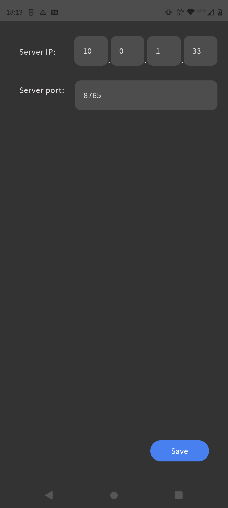
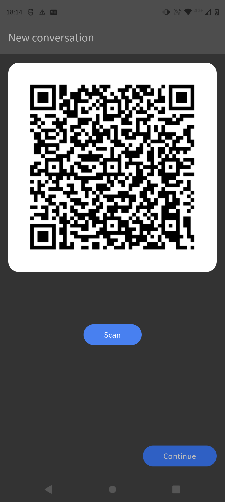
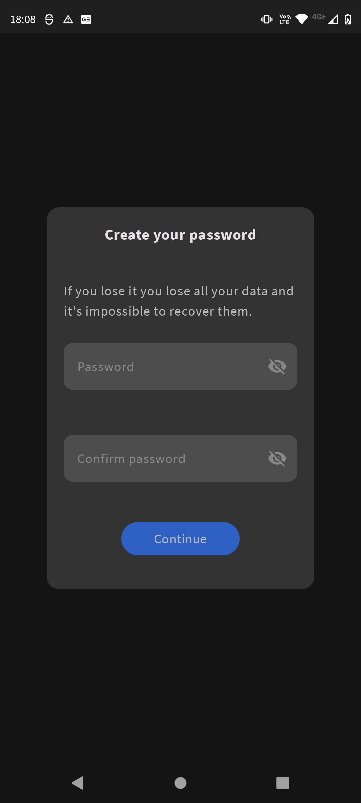
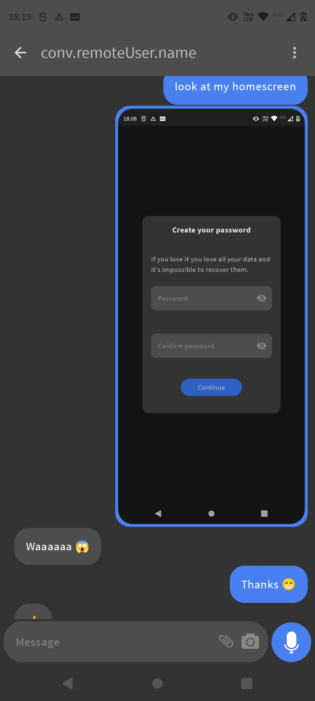

# HMessager

HMessager is a decentralized messaging app for Android based on the [Signal Protocol](https://signal.org/docs/) and build with [Jetpack Compose](https://developer.android.com/jetpack/compose).

This project is under development and not ready for use.

## Server

To setup a server you just have to run the script `server.py` located in the `server` folder.
You can run it on a public IP or in a private network and then do port-forwarding.

The code is pretty straightforward, it's just a simple Websocket server that listen for connections and then forward the messages to clients based on hashed identity if they are connected or store message locally if not.

Then in HMessager, go to the settings screen and enter the IP and port of your server.

---

## Create conversation

To create a conversation with someone, you have to scan his QR code and he must scan yours.

1. Click on the message icon in the bottom right corner of the home screen
2. Click on the scan button to scan the QR code of the person you want to chat with
3. Then click on the code button to show your QR code to the other person
4. The other person must scan your QR code
5. You can now create the conversation

---

## Security

The [X3DH](https://signal.org/docs/specifications/x3dh/) and the [double ratchet algorithm](https://signal.org/docs/specifications/doubleratchet/) are used to provide end-to-end encryption.

### Data storage

All your conversations, settings, keys and messages (including medias) are stored in the files storage of the app inaccessible to other apps and you.
Their are also encrypted with different keys derived from a password that you have to enter when you open the app.

The first time you open the app, you need to choose your password, this password will then be used to derive a master key.
If you forget your password, you will lose all your data and it's impossible to recover them so be aware of that.

### Algorithms used

- SHA3-512 and SHA3-256 for hashing
- X3DH with Curve25519 for key agreement
- HKDF with SHA3-512 for key derivation
- AES-256 for encryption
- Ed25519 for signatures
- HMAC with SHA3-512 for message authentication

---

## Features

- [x] End-to-end encryption with a double ratchet algorithm
- [x] Send and receive text messages
- [x] Send and receive images
- [x] Choose images from gallery
- [x] Take pictures with camera

Currently group conversations are not supported, it's only possible to chat with one person at a time.

## Screenshots

Here an exemple of a conversation with the app.

---

## TODO

- [ ] Add support for audio recording
- [ ] Play audio messages
- [ ] Play video messages
- [ ] Add multiple themes